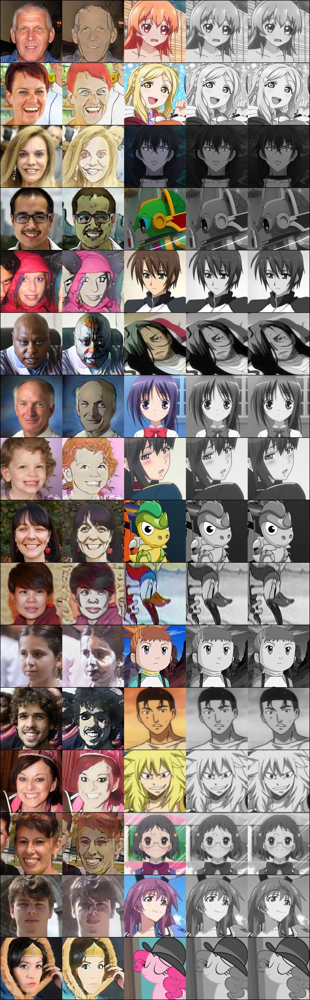

## PyTorch Implementation of [AnimeGANv2](https://github.com/TachibanaYoshino/AnimeGANv2)
# AnimeGAN2 - PyTorch
* This codes are forked from [bryandlee's animegan2 -pytorch](https://github.com/bryandlee/animegan2-pytorch)

## Trained Result (25,000 steps, with 16batchs)
>

## Update
* `2023-12-17` Added training codes
* `2024-01-04` Implemented image logging, save checkpoint
* `2024-01-07` Trained for cartoon dataset

## Training
### Step 1.
Make edge smoothing data
```Bash
python utils/edge_smooth.py --root_dir {ANIME_IMAGE_DIRECTORY} --out_dir {EDGE_SMOOTH_SAVE_DIRECTORY} --image_size {EDGE_SMOOTH_IMAGE_SIZE}
```

### Step 2. 
Train
```Bash
python train.py --photo_dir {PHOTO_IMAGE_DIRECTORY} --anime_dir {ANIME_IMAGE_DIRECTORY} --smooth_dir {SMOOTH_IMAGE_DIRECTORY}
```

## Requirements
* Source repository's requirements
* Pytorch lightning